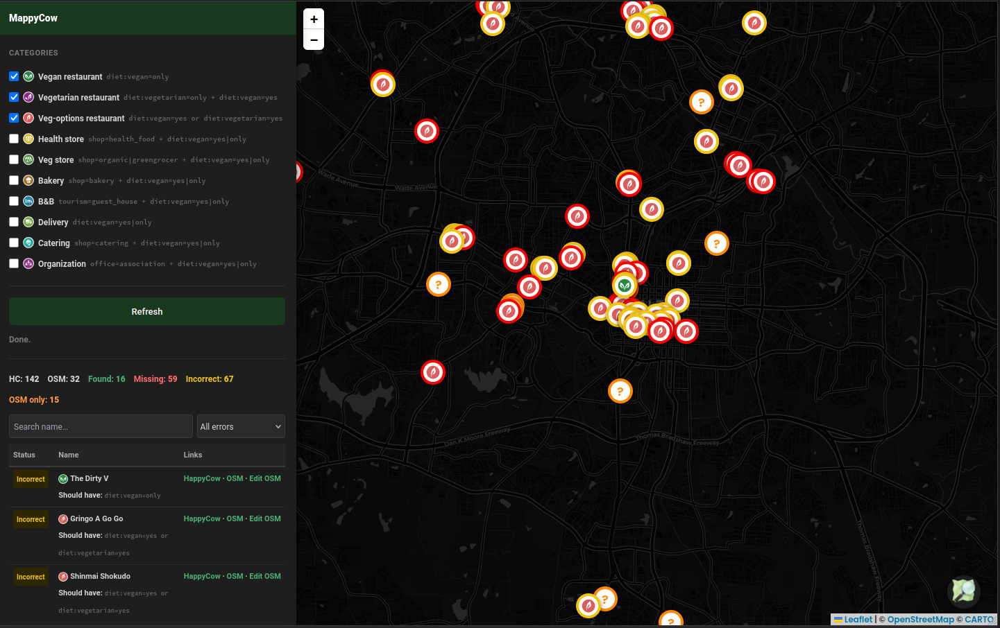

# MappyCow

A browser extension that overlays an OpenStreetMap comparison panel on the [HappyCow](https://www.happycow.net) search map, helping you identify vegan/vegetarian venues that are missing from OSM, incorrectly tagged, or present in OSM but not on HappyCow.

> **See also:** [MappyCow](https://github.com/dkniffin/mappy-cow) — the original standalone web app version, which offers more configuration options but requires manual data collection steps.

## What it does

Open any HappyCow search map page and click the OSM toggle button (bottom-right). The extension will:

1. Scrape HC venue listings for the current map area
2. Query Overpass for OSM venues with veg diet tags in the same area
3. Run a second name-based query to find HC venues that exist in OSM but lack diet tags
4. Display results in a side panel and on a Leaflet map with colour-coded markers:
   - **Red** — missing from OSM entirely
   - **Yellow** — found in OSM but diet tags are wrong or absent
   - **Green** — correctly tagged in OSM
   - **Orange** — in OSM with diet tags but not on HappyCow

## Installation

This extension is not published to any browser add-on store, as it's not intended for widespread
use (and I suspect it woudln't get accepted anyways). Install it as a temporary/unpacked extension.

### Firefox

1. Download or clone this repository
2. Open Firefox and go to `about:debugging`
3. Click **This Firefox** in the left sidebar
4. Click **Load Temporary Add-on…**
5. Navigate to the repository folder and select `manifest.json`

The extension stays active until Firefox is restarted. Repeat these steps after each restart.

### Chrome / Edge / Chromium

1. Download or clone this repository
2. Open `chrome://extensions` (or `edge://extensions`)
3. Enable **Developer mode** (toggle in the top-right)
4. Click **Load unpacked**
5. Select the repository folder

The extension persists across restarts in Chrome/Edge.

## Usage

1. Go to [happycow.net/searchmap](https://www.happycow.net/searchmap) and navigate to an area
2. Click the **OSM button** in the bottom-right corner to open the panel
3. Check the category boxes you want to compare
4. Click **Refresh** to fetch data (or it fetches automatically on first open)
5. Use the filter dropdown to focus on errors, and click map markers or table rows for links to HappyCow and OSM editor
